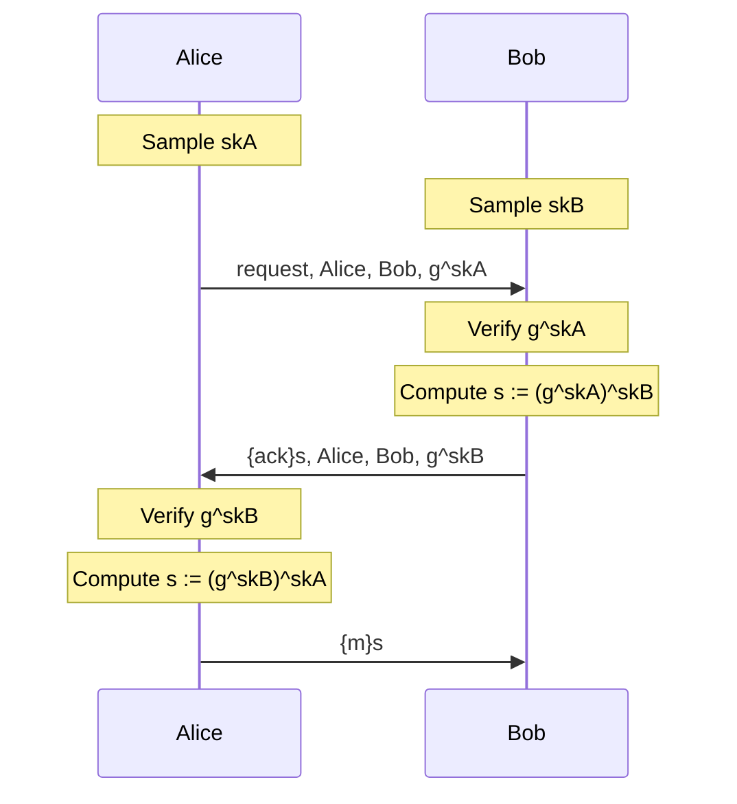

# Exercise 1

In this exercise, you will model the following protocol, an authenticated Diffie-Hellman key exchange.
In the following, `{m}s` denotes the symmetric encryption of message `m` with key `s`.

The file `exADH.spthy` provides you with a skeleton file.
As it stands, the file is in correct Tamarin syntax.
We recommend that you regular try to load your model to Tamarin to check your syntax.

The model uses two built-in *message theories*.
Message theories are sets of function and equations definitions for common use-cases.
For this exercise, the following functions are important: `'g'^sk` (Diffie-Hellman exponentiation; it is a convention to use the constant `'g'` as base of the exponentiation), `senc(m, k)` (symmetric encryption of message `m` under key `k`), and `sdec(m, k)` (symmetric decryption of message `m` under key `k`).

We do not suggest to follow this link now, but you can find the documentation for the built-in message theories [here](https://tamarin-prover.github.io/manual/master/book/004_cryptographic-messages.html#sec:builtin-theories).

The model also comes with an *executability lemma*.
Executability lemmas serve as sanity checks that your model works as you think it does.
This executability lemma ensures that every message can be sent (all parts of your model are reachable).
We recommend verifying the executability lemma whenever load your model after you made some changes.
This catches modelling errors early and thus saves you pain!

Now to the exercise...

## Step 1

The protocol above assumes that Alice and Bob have access to authentic public keys.
Start by implementing the rule `Ltk`, which should model a participant generating a fresh public-private key pair.

You can use the hints below if you get stuck.

  
How do I model key generation?

  Use the Fr fact to model the generation of a fresh, unguessable value.

  
How do I identify participants?

  It is a common convention among modellers to use public values (starting with a dollar) to model identifiers for participants.

  
How do I model that a participants memorizes their key?

  Use persistent facts (starting with a !).

