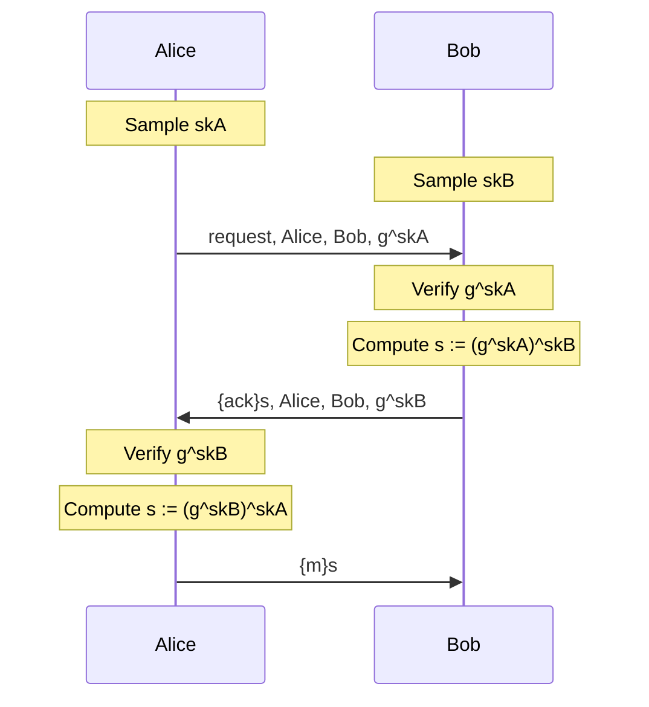

# Authenticated Diffie-Hellman Exercise

In this exercise, you will model the following protocol, an authenticated Diffie-Hellman key exchange.
In the following, `{m}s` denotes the symmetric encryption of message `m` with key `s`.

The file `exADH.spthy` provides you with a skeleton model.
As it stands, the model is in correct Tamarin syntax.
We recommend that you regularly try to load your model to Tamarin to check your syntax.

The model uses two built-in *message theories*.
Message theories are sets of function and equations definitions for common use-cases.
For this exercise, the following functions are important: `'g'^sk` (Diffie-Hellman exponentiation; it is a convention to use the constant `'g'` as base of the exponentiation), `senc(m, k)` (symmetric encryption of message `m` under key `k`), and `sdec(m, k)` (symmetric decryption of message `m` under key `k`).

We do not suggest following this link now, but you can find the documentation for the built-in message theories [here](https://tamarin-prover.github.io/manual/master/book/004_cryptographic-messages.html#sec:builtin-theories).

The model also comes with an *executability lemma*.
Executability lemmas serve as sanity checks that your model works as you think it does.
This executability lemma ensures that every message can be sent (all parts of your model are reachable).
We recommend verifying the executability lemma whenever load your model after you made some changes.
This catches modelling errors early and thus saves you pain!

Now to the exercise...

## Step 1

The protocol above assumes that Alice and Bob have access to authentic public keys.
Start by implementing the rule `Ltk`, which should model a participant generating a fresh public-private key pair.

If you get stuck, we encourage you to talk to your peers!
But note that, in general, there is no right or wrong way to model a protocol.

## Step 2

Now model all three protocol steps one-by-one.
We suggest following the state-read/message-in + state-write/message-out pattern.
The skeleton file has been prepared to follow this pattern.
For each rule's premise and conclusion, you will need to add more facts, though!

Note that Tamarin supports some laws for `^`, in particular, `(a^b)^c = (a^c)^b`.

Don't forget to regularly load your model, and check the executability lemma!

## Step 3

Now you can prove properties of your model!
Look at the lemmas that are commented out in the skeleton file.
Do you expect them to hold for the protocol specification above?

Comment them out and try proving them!
Discuss your results with your peers.

  
Expected results

  All lemmas should verify successfully.

